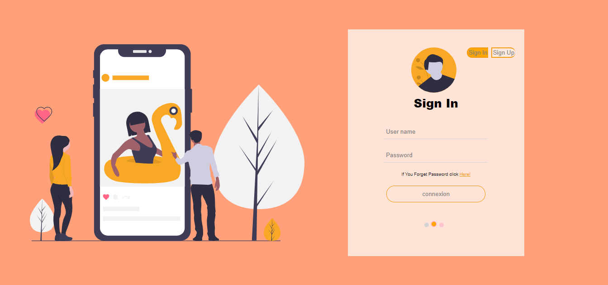
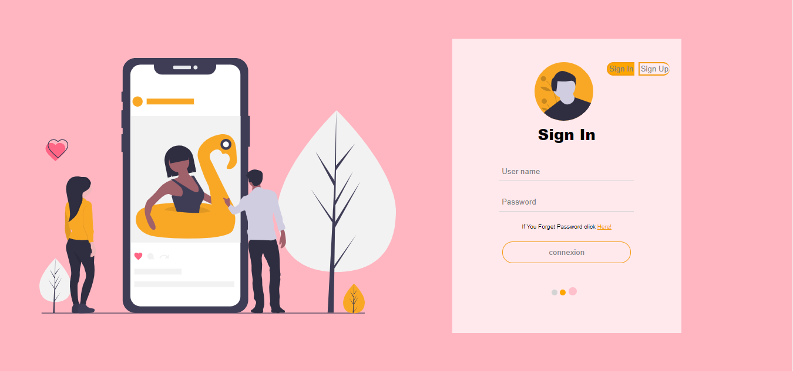
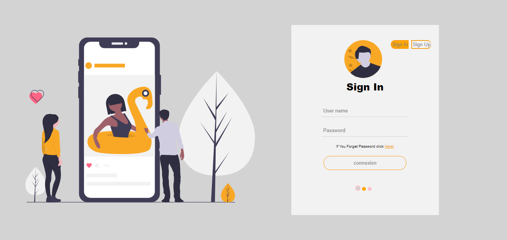
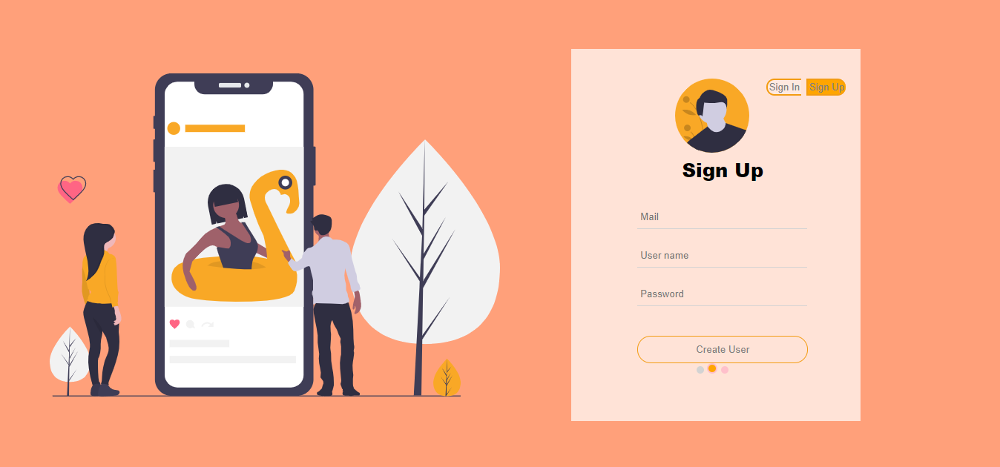
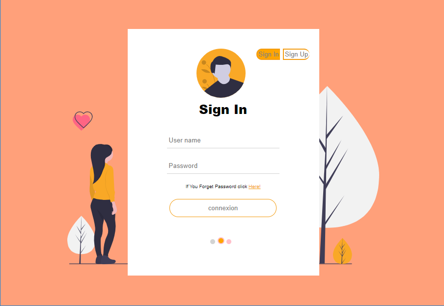
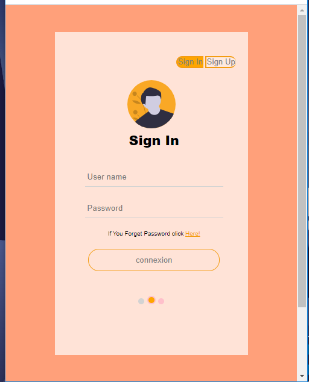

# responsive-loginPage-Just-Css

<h2>if you want to take a look of the 'responsive_login_page' how is work, you can visit my codepen account.
so click the icon 👉👉
👈👈</h2>

### In this project i used "Media queries in CSS3 extended the CSS2 media types" to make the the web page responsive without using framework like (bootstrap, thailwand, materialize ...) and i used the javascript file to make signIn and signIn In One component with transisition css effet with (javascript DOM) and to change theme of the web page.

## Theme of the login page

## Sign-Up/Forget-Password

## Responsive using( Media queries )

### for TABLET SCREEN

### for MOBILE SCREEN

